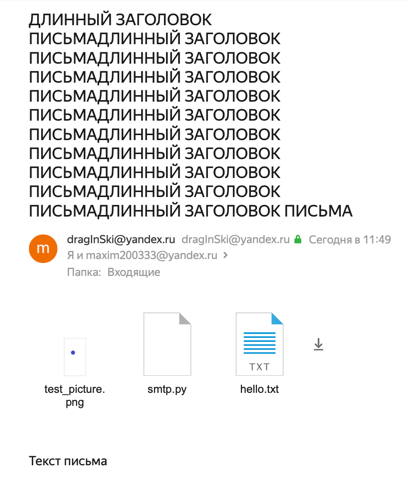

# internet-protocols
## Task3 (5): SMTP-client

### Описание:
SMTP клиент. В текстовом файле пользователь пишет текст письма на английском или русском языке. 
В конфигурационном файле пользователь задает адреса отправителя и получателя(лей) на яндекс почте, 
тему (возможно на русской языке) и путь до папки с файлами-аттачментами для отсылки в виде вложения.
Письмо со всем этим содержимым отправляется на yandex почту получателя(лей)

### Preparation:
1. В файле pswd.txt ввести пароль от yandex-mail приложения
2. В файле config.json
   - написать свой адрес в яндекс почте в поле from
   - написать получателя(лей) в поле to
   - в поле subject - заголовок письма
   - в поле attachments_path путь до папки, где лежат вложения
3. В файле msg.txt написать текст письма

### Usage:
```
python main.py
```

### Результат:

